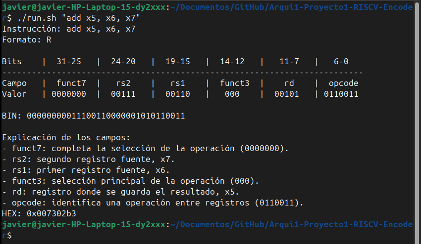
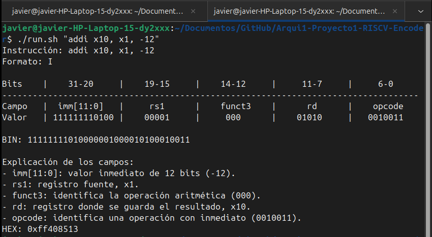
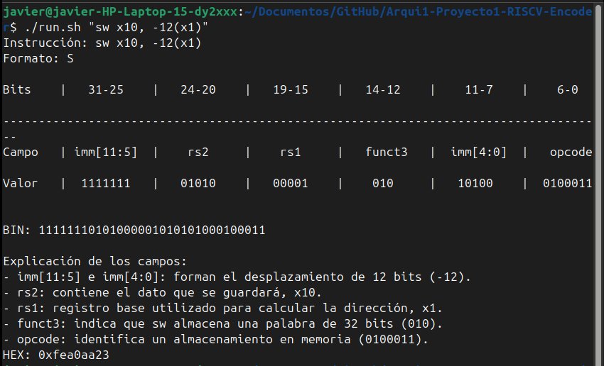
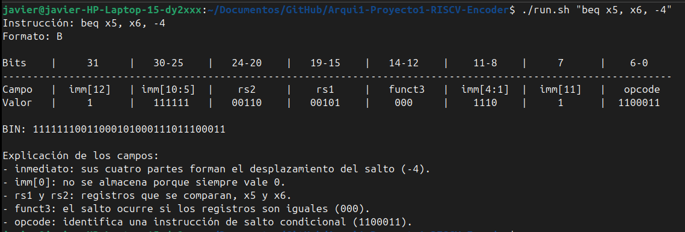
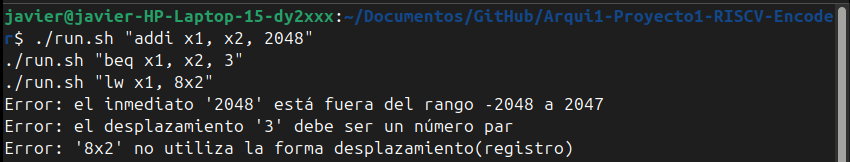

# Codificador educativo de instrucciones RISC-V RV32I

**CE4301 Arquitectura de Computadores I, segundo semestre de 2026**

**Estudiante:** Javier Hernández Castillo  
**Carné:** 2022321746  
**Profesor:** Dr.-Ing. Jeferson González Gómez  
**Institución:** Instituto Tecnológico de Costa Rica

## Descripción

Este proyecto consiste en un codificador de instrucciones de la ISA base **RV32I**. El programa recibe una instrucción escrita en la terminal y la convierte a su representación binaria y hexadecimal de 32 bits.

La idea no es mostrar únicamente el resultado final. También se imprimen los campos que forman la instrucción, los bits que ocupa cada uno y una explicación corta de para qué sirven. Esto permite revisar con más facilidad cómo se construyen los formatos R, I, S y B.

Los campos de codificación se consultaron en el manual oficial de RISC-V [1], mientras que el alcance y los requisitos del programa se tomaron de la especificación del proyecto [2].

Por ejemplo, la instrucción:

```text
add x5, x6, x7
```

produce la palabra:

```text
HEX: 0x007302b3
```

## Instrucciones soportadas

El subconjunto utilizado es exactamente el que se indica en la especificación del proyecto:


*Figura 1. Instrucciones que debe soportar el codificador según la especificación [2].*

Los registros deben escribirse entre `x0` y `x31`. Los inmediatos y desplazamientos pueden ser positivos o negativos, siempre que se encuentren dentro del rango permitido por su formato.

## Requisitos

Para ejecutar el codificador se necesita:

- GNU/Linux.
- Python 3.10 o una versión posterior.
- Bash.

Para ejecutar la validación contra el toolchain oficial también se requiere:

- GNU Binutils para RISC-V (`riscv64-unknown-elf-as`, `ld` y `objdump`).

En Ubuntu puede instalarse con:

```bash
sudo apt update
sudo apt install binutils-riscv64-unknown-elf
```

## Uso

Primero debe darse permiso de ejecución al archivo de entrada:

```bash
chmod +x run.sh
```

Luego se pasa la instrucción completa como un único argumento entre comillas:

```bash
./run.sh "add x5, x6, x7"
```

La especificación también establece este punto de entrada y muestra ejemplos para los distintos formatos:


*Figura 2. Forma de ejecutar el programa y ejemplos proporcionados en la especificación [2].*

La última línea siempre conserva el siguiente formato, requerido para la validación automática:

```text
HEX: 0xXXXXXXXX
```

## Estructura del proyecto

```text
Arqui1-Proyecto1-RISCV-Encoder/
├── encoder_skeleton.py
├── run.sh
├── README.md
├── vectores_ejemplo.txt
├── validacion_resultados.md
├── tests/
│   └── validate_against_toolchain.py
└── docs/
    └── img/
```

- `encoder_skeleton.py`: contiene el parser, las tablas de instrucciones, la codificación y la explicación visual.
- `run.sh`: punto de entrada requerido para ejecutar el programa.
- `vectores_ejemplo.txt`: contiene los ejemplos iniciales proporcionados con el kit del proyecto.
- `validacion_resultados.md`: contiene la comparación de los 36 casos contra el toolchain oficial.
- `tests/validate_against_toolchain.py`: compara el encoder con las herramientas oficiales de RISC-V.
- `docs/img/`: contiene las capturas `ss1.png` a `ss8.png` utilizadas en este documento.

## Arquitectura del programa

Todo el proceso principal está en `encoder_skeleton.py`. Para que el archivo no quedara como una sola función extensa, lo dividí en varias partes pequeñas.

Al inicio se encuentran las tablas de instrucciones. En ellas se guardan los valores fijos de cada mnemónico, como `opcode`, `funct3` y `funct7`. De esta forma no es necesario repetir esos valores dentro de cada función.

Después aparecen las funciones auxiliares que procesan la entrada:

- `_split_instruction()` separa el mnemónico de los operandos.
- `_parse_register()` convierte un registro como `x5` al número `5` y revisa que esté entre `x0` y `x31`.
- `_parse_immediate()` valida los inmediatos de 12 bits.
- `_parse_branch_offset()` valida los desplazamientos de los saltos y comprueba que sean pares.
- `_parse_memory_operand()` separa expresiones como `8(x6)` en desplazamiento y registro base.

La codificación se hace en funciones distintas para R, I, S y B. Decidí separar las instrucciones I aritméticas de las cargas porque, aunque usan el mismo formato de bits, su sintaxis no es igual. Por ejemplo, `addi` recibe tres operandos separados, mientras que `lw` utiliza la forma `desplazamiento(registro)`.

`encode_instruction()` funciona como coordinador: reconoce el mnemónico y envía los operandos al codificador correspondiente. Cada codificador coloca los campos en su posición mediante desplazamientos de bits y luego los une con operaciones OR.

Por último, `explain_instruction()` vuelve a separar la palabra codificada para mostrar sus campos. La función `main()` recibe el argumento enviado desde `run.sh`, controla los posibles errores e imprime la explicación, el binario y la línea `HEX`.

En resumen, el recorrido de una instrucción es:

```text
run.sh -> main() -> encode_instruction() -> codificador del formato
       -> explain_instruction() -> salida BIN y HEX
```

## Formatos de instrucción

La distribución de los campos se tomó de la tabla **RV32I Base Instruction Set** [1]. En el código se manejan de esta forma:

- **R:** usa `funct7`, `rs2`, `rs1`, `funct3`, `rd` y `opcode`.
- **I:** coloca un inmediato de 12 bits antes de `rs1`, `funct3`, `rd` y `opcode`.
- **S:** divide el inmediato entre `imm[11:5]` e `imm[4:0]`.
- **B:** reparte el desplazamiento entre `imm[12]`, `imm[10:5]`, `imm[4:1]` e `imm[11]`; el bit cero no se almacena.

## Validación

La especificación solicita al menos tres casos distintos para cada una de las 12 instrucciones:


*Figura 3. Cantidad y tipo de pruebas solicitadas para la validación [2].*

El script ejecuta `run.sh`, ensambla el mismo caso para `rv32i`, obtiene la referencia con `objdump -d` y compara ambas palabras. Los 36 casos cubren registros comunes y extremos, inmediatos positivos y negativos y valores límite.

### Entorno utilizado

Las versiones utilizadas para ejecutar y validar el proyecto fueron:

```text
Python 3.12.3
GNU assembler (2.42-1ubuntu1+6) 2.42
```

### Resultado de la validación

```bash
python3 tests/validate_against_toolchain.py \
  --report validacion_resultados.md
```

Los **36 casos coincidieron**. La comparación completa puede consultarse en [validacion_resultados.md](validacion_resultados.md).

## Ejemplos de salida

### Formato R

```bash
./run.sh "add x5, x6, x7"
```



*Figura 4. Codificación y explicación de `add x5, x6, x7`.*

### Formato I

```bash
./run.sh "addi x10, x1, -12"
```



*Figura 5. Codificación y explicación de `addi x10, x1, -12`.*

### Formato S

```bash
./run.sh "sw x10, -12(x1)"
```



*Figura 6. Codificación y explicación de `sw x10, -12(x1)`.*

### Formato B

```bash
./run.sh "beq x5, x6, -4"
```



*Figura 7. Codificación y explicación de `beq x5, x6, -4`.*

## Manejo de errores

El programa rechaza instrucciones no soportadas, registros fuera de `x0` a `x31`, cantidades incorrectas de operandos, inmediatos fuera de rango, saltos impares y operandos de memoria mal escritos. En estos casos muestra el problema y no genera una línea `HEX`.

```bash
./run.sh "addi x1, x2, 2048"
./run.sh "beq x1, x2, 3"
./run.sh "lw x1, 8x2"
```



*Figura 8. Mensajes producidos al detectar diferentes errores de entrada.*

## Fuentes consultadas

Los valores de `opcode`, `funct3`, `funct7` y la distribución de los inmediatos se obtuvieron de la tabla **RV32I Base Instruction Set** [1]. La especificación del proyecto [2] se utilizó para definir las instrucciones soportadas, el modo de ejecución y los casos que debían validarse.

## Referencias

[1] A. Waterman and K. Asanović, Eds., *The RISC-V Instruction Set Manual, Volume I: Unprivileged ISA*, document version 20191213. RISC-V Foundation, 2019, p. 130.

[2] J. González Gómez, “Proyecto Individual: Codificador Educativo de Instrucciones RISC-V,” especificación de proyecto, CE-4301 Arquitectura de Computadores I, Instituto Tecnológico de Costa Rica, 2026.
