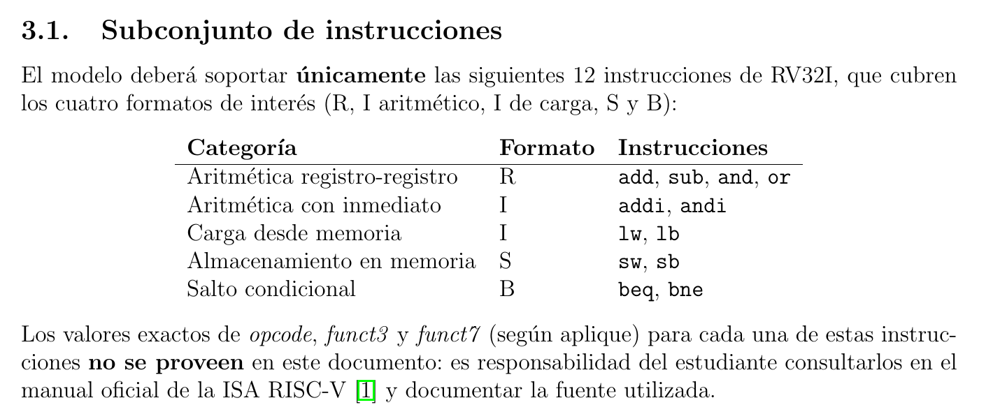
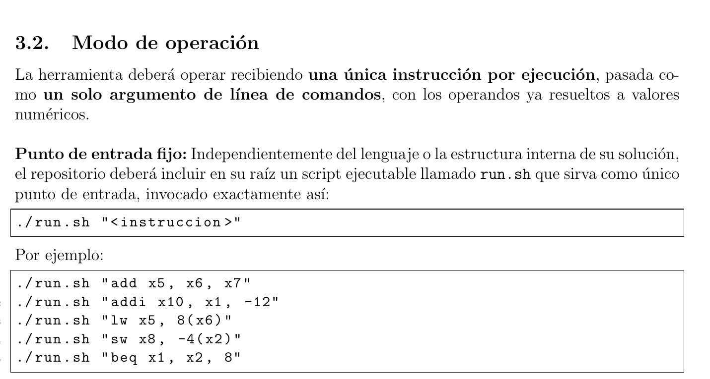
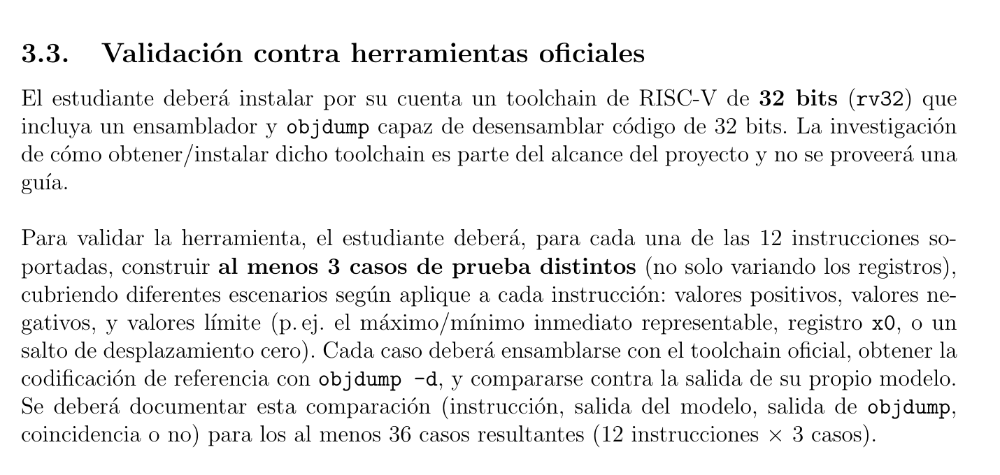

# Codificador educativo de instrucciones RISC-V RV32I

**CE4301 Arquitectura de Computadores I, segundo semestre de 2026**

**Estudiante:** Javier Hernández Castillo  
**Carné:** 2022321746  
**Profesor:** Dr.-Ing. Jeferson González Gómez  
**Institución:** Instituto Tecnológico de Costa Rica

## Descripción

Este proyecto consiste en un codificador de instrucciones de la ISA base **RV32I**. El programa recibe una instrucción escrita en la terminal y la convierte a su representación binaria y hexadecimal de 32 bits.

La idea no es mostrar únicamente el resultado final. También se imprimen los campos que forman la instrucción, los bits que ocupa cada uno y una explicación corta de para qué sirven. Esto permite revisar con más facilidad cómo se construyen los formatos R, I, S y B.

Por ejemplo, la instrucción:

```text
add x5, x6, x7
```

produce la palabra:

```text
HEX: 0x007302b3
```

## Instrucciones soportadas

El subconjunto utilizado es exactamente el que se indica en la especificación del proyecto:



*Figura 1. Instrucciones que debe soportar el codificador según la especificación.*

Los registros deben escribirse entre `x0` y `x31`. Los inmediatos y desplazamientos pueden ser positivos o negativos, siempre que se encuentren dentro del rango permitido por su formato.

## Requisitos

Para ejecutar el codificador se necesita:

- GNU/Linux.
- Python 3.10 o una versión posterior.
- Bash.

Para ejecutar la validación contra el toolchain oficial también se requiere:

- GNU Binutils para RISC-V (`riscv64-unknown-elf-as`, `ld` y `objdump`).

En Ubuntu puede instalarse con:

```bash
sudo apt update
sudo apt install binutils-riscv64-unknown-elf
```

## Uso

Primero debe darse permiso de ejecución al archivo de entrada:

```bash
chmod +x run.sh
```

Luego se pasa la instrucción completa como un único argumento entre comillas:

```bash
./run.sh "add x5, x6, x7"
```

La especificación también establece este punto de entrada y muestra ejemplos para los distintos formatos:



*Figura 2. Forma de ejecutar el programa y ejemplos proporcionados en la especificación.*

La última línea siempre conserva el siguiente formato, requerido para la validación automática:

```text
HEX: 0xXXXXXXXX
```

## Estructura del proyecto

```text
Arqui1-Proyecto1-RISCV-Encoder/
├── encoder_skeleton.py
├── run.sh
├── README.md
├── vectores_ejemplo.txt
├── tests/
│   └── validate_against_toolchain.py
└── docs/
    ├── validation-results.md
    └── img/
        ├── ss1.png
        ├── ss2.png
        └── ss3.png
```

- `encoder_skeleton.py`: contiene el parser, las tablas de instrucciones, la codificación y la explicación visual.
- `run.sh`: punto de entrada requerido para ejecutar el programa.
- `vectores_ejemplo.txt`: contiene los ejemplos iniciales proporcionados con el kit del proyecto.
- `tests/validate_against_toolchain.py`: compara el encoder con las herramientas oficiales de RISC-V.
- `docs/validation-results.md`: conserva la evidencia generada durante la validación.
- `docs/img/`: contiene las capturas utilizadas en este documento.

## Arquitectura del programa

Todo el proceso principal está en `encoder_skeleton.py`. Para que el archivo no quedara como una sola función extensa, lo dividí en varias partes pequeñas.

Al inicio se encuentran las tablas de instrucciones. En ellas se guardan los valores fijos de cada mnemónico, como `opcode`, `funct3` y `funct7`. De esta forma no es necesario repetir esos valores dentro de cada función.

Después aparecen las funciones auxiliares que procesan la entrada:

- `_split_instruction()` separa el mnemónico de los operandos.
- `_parse_register()` convierte un registro como `x5` al número `5` y revisa que esté entre `x0` y `x31`.
- `_parse_immediate()` valida los inmediatos de 12 bits.
- `_parse_branch_offset()` valida los desplazamientos de los saltos y comprueba que sean pares.
- `_parse_memory_operand()` separa expresiones como `8(x6)` en desplazamiento y registro base.

La codificación se hace en funciones distintas para R, I, S y B. Decidí separar las instrucciones I aritméticas de las cargas porque, aunque usan el mismo formato de bits, su sintaxis no es igual. Por ejemplo, `addi` recibe tres operandos separados, mientras que `lw` utiliza la forma `desplazamiento(registro)`.

`encode_instruction()` funciona como coordinador: reconoce el mnemónico y envía los operandos al codificador correspondiente. Cada codificador coloca los campos en su posición mediante desplazamientos de bits y luego los une con operaciones OR.

Por último, `explain_instruction()` vuelve a separar la palabra codificada para mostrar sus campos. La función `main()` recibe el argumento enviado desde `run.sh`, controla los posibles errores e imprime la explicación, el binario y la línea `HEX`.

En resumen, el recorrido de una instrucción es:

```text
run.sh -> main() -> encode_instruction() -> codificador del formato
       -> explain_instruction() -> salida BIN y HEX
```

## Validación

La especificación solicita al menos tres casos distintos para cada una de las 12 instrucciones:



*Figura 3. Cantidad y tipo de pruebas solicitadas para la validación.*

Para cumplir este requisito, el codificador fue comparado con GNU `as`, `ld` y `objdump` para RISC-V. Los **36 casos de prueba** coincidieron con el toolchain oficial.

La validación puede repetirse con:

```bash
python3 tests/validate_against_toolchain.py \
  --report docs/validation-results.md
```

El detalle de los resultados se encuentra en [docs/validation-results.md](docs/validation-results.md).

## Fuente de la codificación

Los valores de `opcode`, `funct3`, `funct7` y la distribución de los inmediatos se obtuvieron de la tabla **RV32I Base Instruction Set** del manual oficial de la ISA RISC-V.
